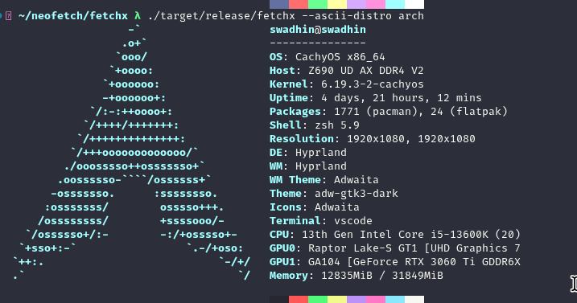
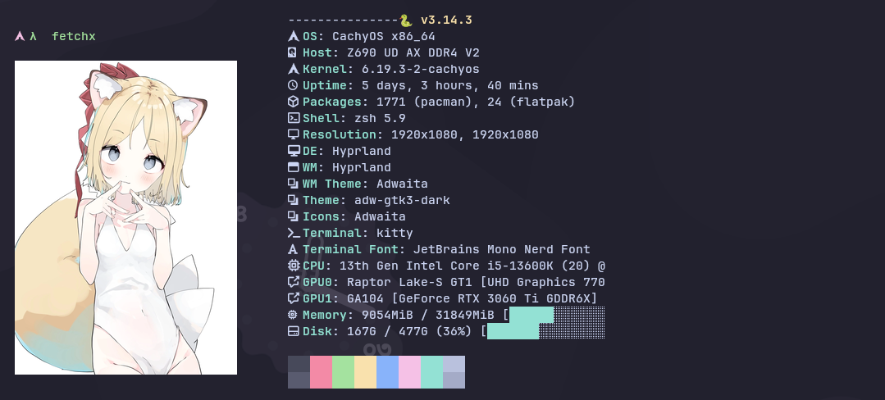
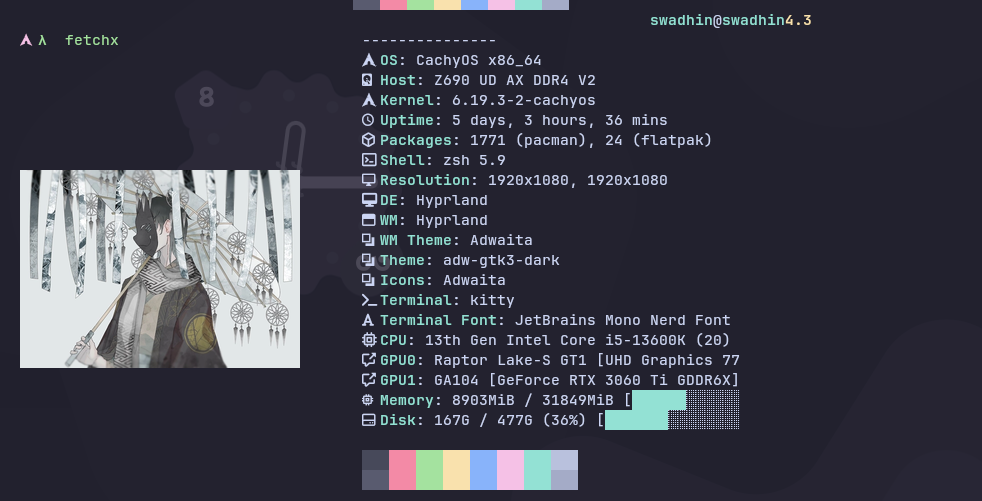
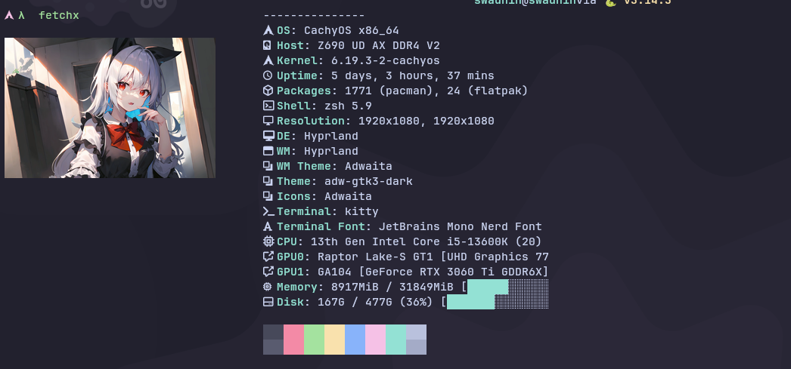
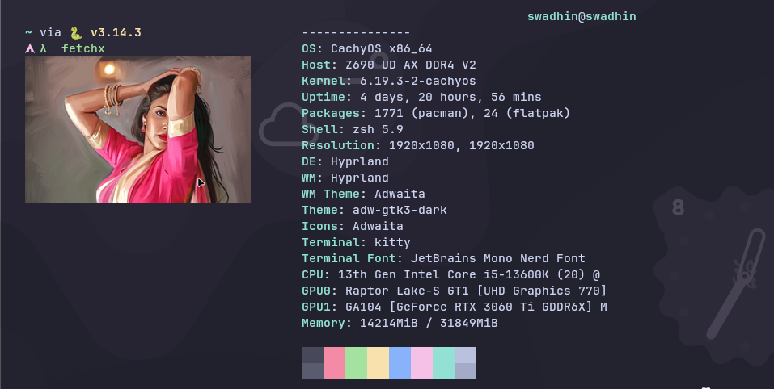
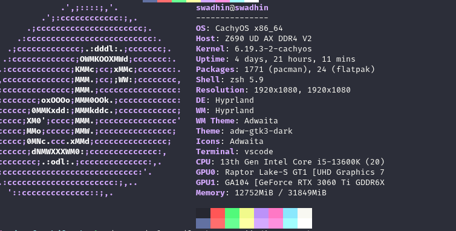

<!--
  FetchX — Fast Neofetch Alternative Written in Rust
  Keywords: neofetch, neofetch alternative, system info, fetch, rust, terminal,
            linux, ascii art, kitty, ricing, unixporn, dotfiles, system fetch,
            fastfetch alternative, screenfetch, pfetch, macchina
-->

<h1 align="center">
  <br>
  ⚡ FetchX
  <br>
</h1>

<h4 align="center">A blazing-fast, feature-rich system information tool written in Rust.<br>The modern neofetch replacement you've been waiting for.</h4>

<p align="center">
  <a href="./LICENSE"></a>
  <a href="https://crates.io/crates/fetchx"></a>
  <a href="https://aur.archlinux.org/packages/fetchx"></a>
  <a href="https://github.com/swadhinbiswas/fetchx/releases"></a>
  <a href="https://www.rust-lang.org/"></a>
  <a href="https://github.com/swadhinbiswas/fetchx/actions"></a>
  <a href="https://github.com/swadhinbiswas/fetchx/stargazers"></a>
</p>

<p align="center">
  <a href="#installation">Installation</a> •
  <a href="#features">Features</a> •
  <a href="#configuration">Configuration</a> •
  <a href="#gallery">Gallery</a> •
  <a href="#shell-aliases-replace-neofetch">Replace Neofetch</a>
</p>

<!-- Hero Screenshot -->
<p align="center">
  
</p>

---

## Gallery

<table>
  <tr>
    <td align="center" width="50%">
      
      <br><b>ASCII Art Mode</b>
      <br><sub>Classic distro logo with system info</sub>
    </td>
    <td align="center" width="50%">
      
      <br><b>Kitty Image Backend</b>
      <br><sub>Auto-fetched image via smart caching</sub>
    </td>
  </tr>
  <tr>
    <td align="center" width="50%">
      
      <br><b>Random Image Every Run</b>
      <br><sub>Background download, zero delay</sub>
    </td>
    <td align="center" width="50%">
      
      <br><b>Smart Image Caching</b>
      <br><sub>Previous image shown instantly</sub>
    </td>
  </tr>
  <tr>
    <td align="center" width="50%">
      
      <br><b>Custom Image</b>
      <br><sub>Use your own wallpaper or photo</sub>
    </td>
    <td align="center" width="50%">
      
      <br><b>Nerd Fonts + Progress Bars</b>
      <br><sub>Memory & disk usage bars with icons</sub>
    </td>
  </tr>
</table>

---

## Table of Contents

- [Gallery](#gallery)
- [Features](#features)
- [Installation](#installation)
  - [Quick Install (Recommended)](#quick-install-recommended)
  - [From Source (Manual)](#from-source-manual)
  - [With Make](#with-make)
  - [From Cargo](#from-cargo)
  - [Arch Linux / CachyOS / Manjaro (AUR)](#arch-linux--cachyos--manjaro-aur)
  - [Debian / Ubuntu / APT](#debian--ubuntu--apt)
- [Shell Aliases (Replace neofetch)](#shell-aliases-replace-neofetch)
- [Configuration](#configuration)
  - [Getting Started](#getting-started)
  - [Config File Location](#config-file-location)
  - [Full Configuration Reference](#full-configuration-reference)
  - [Example Configs](#example-configs)
- [Usage](#usage)
- [Image Backends](#image-backends)
  - [How Smart Image Fetching Works](#how-smart-image-fetching-works)
- [Advanced Features](#advanced-features)
- [Information Displayed](#information-displayed)
- [Supported Distributions](#supported-distributions)
- [Comparison with Neofetch](#comparison-with-neofetch)
- [Dependencies](#dependencies)
- [Uninstalling](#uninstalling)
- [Contributing](#contributing)
- [Star History](#star-history)
- [License](#license)

---

## Features

> **Why FetchX over neofetch?** Neofetch is [no longer maintained](https://github.com/dylanaraps/neofetch/issues/2691). FetchX is a modern, actively developed replacement written in Rust — 10x faster, with image support and smart caching built in.

- **Blazing Fast** — Parallel info detection across 8 threads, finishes in ~10-50ms (vs neofetch's ~200-500ms)
- **Tiny Binary** — ~1.8 MB stripped, LTO-optimized — no Python, no Bash, no runtime deps
- **TOML Config** — Clean `~/.config/fetchx/config.toml` with 35+ options (no scripting needed)
- **5 Image Backends** — Kitty graphics protocol, Sixel, Chafa, w3m, iTerm2
- **Smart Image Caching** — Auto-downloads random images from API, shows instantly with zero delay, new image every run
- **60+ Distro Logos** — ASCII art with `{c1}`-`{c6}` color placeholders
- **Nerd Font Icons** — Optional icons for every info label (requires [Nerd Font](https://www.nerdfonts.com/))
- **Progress Bars** — Visual bars for memory and disk usage `[███████░░░░]`
- **Emoji Mode** — Fun emoji art alternative to ASCII logos
- **JSON Output** — Machine-readable `--json` flag for scripting & automation
- **Custom ASCII Art** — Load your own art from any text file
- **256-Color Support** — Full terminal color palette
- **Terminal-Width Aware** — Lines truncate cleanly, never wraps
- **Interactive Image Picker** — Browse & select images with fzf
- **Daemon Mode** — Background service for Waybar/Polybar/status bar integration
- **Drop-in neofetch replacement** — `alias neofetch='fetchx'` and you're done

---

## Installation

### Quick Install (Recommended)

One-liner that clones, builds, installs, and sets up aliases:

```bash
curl -fsSL https://raw.githubusercontent.com/swadhinbiswas/fetchx/main/install.sh | bash
```

Or with wget:

```bash
wget -qO- https://raw.githubusercontent.com/swadhinbiswas/fetchx/main/install.sh | bash
```

**Install script options:**

```bash
./install.sh                  # Install to ~/.local/bin (default)
./install.sh --system         # Install to /usr/local/bin (requires sudo)
./install.sh --prefix=/opt    # Custom prefix
./install.sh --no-alias       # Skip shell alias setup
./install.sh --uninstall      # Remove FetchX completely
```

### From Source (Manual)

**Prerequisites:** [Rust toolchain](https://rustup.rs/) (rustc + cargo)

```bash
# Install Rust (if not already installed)
curl --proto '=https' --tlsv1.2 -sSf https://sh.rustup.rs | sh
source ~/.cargo/env

# Clone and build
git clone https://github.com/swadhinbiswas/fetchx.git
cd fetchx/fetchx

# Build optimized release binary
cargo build --release

# Install to user directory (no sudo needed)
mkdir -p ~/.local/bin
install -m 755 target/release/fetchx ~/.local/bin/fetchx

# Make sure ~/.local/bin is in your PATH (see Shell Setup below)
```

**System-wide install (requires sudo):**

```bash
sudo install -m 755 target/release/fetchx /usr/local/bin/fetchx
```

### With Make

```bash
git clone https://github.com/swadhinbiswas/fetchx.git
cd fetchx/fetchx
make                    # Build
sudo make install       # Install to /usr/local/bin
# or
make PREFIX=~/.local install   # Install to ~/.local/bin
```

### From Cargo

```bash
# Install from crates.io (recommended)
cargo install fetchx

# Or install from git
cargo install --git https://github.com/swadhinbiswas/fetchx.git
```

### Arch Linux / CachyOS / Manjaro (AUR)

<a href="https://aur.archlinux.org/packages/fetchx"></a>
<a href="https://aur.archlinux.org/packages/fetchx-git"></a>

```bash
# Stable version (recommended)
yay -S fetchx

# Or git version (latest features)
yay -S fetchx-git

# With paru
paru -S fetchx
# or
paru -S fetchx-git
```

### Debian / Ubuntu / APT

```bash
# Download the .deb package from releases
# https://github.com/swadhinbiswas/fetchx/releases

# Install with:
sudo dpkg -i fetchx_0.2.0_amd64.deb
sudo apt-get install -f  # install dependencies

# Or build from source:
./build-deb.sh---
```


## Shell Aliases (Replace neofetch)

Set up aliases so `fetch` or `neofetch` runs FetchX instead.

### Bash (`~/.bashrc`)

```bash
# Add to the end of ~/.bashrc
export PATH="$HOME/.local/bin:$PATH"   # if installed to ~/.local/bin

# FetchX aliases
alias fetch='fetchx'
alias neofetch='fetchx'
```

Then reload:

```bash
source ~/.bashrc
```

### Zsh (`~/.zshrc`)

```bash
# Add to the end of ~/.zshrc
export PATH="$HOME/.local/bin:$PATH"   # if installed to ~/.local/bin

# FetchX aliases
alias fetch='fetchx'
alias neofetch='fetchx'
```

Then reload:

```bash
source ~/.zshrc
```

### Fish (`~/.config/fish/config.fish`)

```fish
# Add to ~/.config/fish/config.fish
fish_add_path ~/.local/bin              # if installed to ~/.local/bin

# FetchX aliases
alias fetch 'fetchx'
alias neofetch 'fetchx'
```

Then reload:

```fish
source ~/.config/fish/config.fish
```

### Nushell (`~/.config/nushell/config.nu`)

```nu
# Add to config.nu
alias fetch = fetchx
alias neofetch = fetchx
```

### PowerShell (WSL) (`$PROFILE`)

```powershell
Set-Alias -Name fetch -Value fetchx
Set-Alias -Name neofetch -Value fetchx
```

> **Tip:** The install script (`install.sh`) automatically sets up aliases for your current shell.

---

## Configuration

### Getting Started

Create the default config file:

```bash
fetchx --create-config
```

This creates `~/.config/fetchx/config.toml` with all options documented.

To view the config path:

```bash
fetchx --show-config
```

To print the full default config to stdout (useful for reference):

```bash
fetchx --print-config
```

### Config File Location

| OS    | Path                                               |
| ----- | -------------------------------------------------- |
| Linux | `~/.config/fetchx/config.toml`                     |
| macOS | `~/Library/Application Support/fetchx/config.toml` |

### Full Configuration Reference

The config file is TOML format. Every option has a sensible default — you only need to set what you want to change.

```toml
# =============================================================================
# FetchX Configuration — ~/.config/fetchx/config.toml
# =============================================================================

# ─── Display ─────────────────────────────────────────────────────────────────

no_color = false           # Disable all colors (useful for piping)
bold = true                # Enable bold text
separator = ": "           # Separator between label and value (e.g., "OS: Arch")

# ─── Colors ──────────────────────────────────────────────────────────────────
# "distro" = automatically match your distro's colors (default)
# Or use an array of up to 6 color numbers:
#   [title, @-symbol, underline, subtitle, colon, info-text]
#
# Color numbers: 0=black, 1=red, 2=green, 3=yellow, 4=blue,
#                5=magenta, 6=cyan, 7=white, 8-255=256-color palette

colors = "distro"
# colors = [4, 6, 1, 8, 8, 6]   # Custom: blue title, cyan @, red underline

# ─── Image Backend ───────────────────────────────────────────────────────────
# Which rendering method to use for the logo/image area
#
# Values:
#   "ascii"  — Text-based ASCII art (works everywhere)
#   "kitty"  — Kitty graphics protocol (best quality, kitty terminal only)
#   "sixel"  — Sixel graphics (xterm, mlterm, foot — needs img2sixel)
#   "chafa"  — Unicode art via chafa (works in any terminal — needs chafa)
#   "w3m"    — w3m image display (X11 terminals — needs w3mimgdisplay)
#   "iterm2" — iTerm2 inline images (macOS iTerm2 only)
#   "off"    — No logo/image at all

image_backend = "ascii"

# ─── Image Source ────────────────────────────────────────────────────────────
# Where to get the image when using a graphics backend (kitty/sixel/etc)
#
# Values:
#   "auto"      — Smart caching: downloads random images from API,
#                  shows previous image instantly, downloads new one
#                  in background for next run
#   "ascii"     — Force ASCII art even with graphics backend
#   "wallpaper" — Use your current desktop wallpaper
#   "/path/to/image.png" — Use a specific image file

image_source = "auto"

# ─── ASCII Art ───────────────────────────────────────────────────────────────

# Which distro's ASCII logo to show (when image_backend = "ascii")
# "auto" detects from /etc/os-release
# Or specify: "arch", "ubuntu", "debian", "fedora", "cachyos", "nixos",
#             "manjaro", "void", "pop", "endeavouros", "gentoo", "kali",
#             "opensuse", "linuxmint", "alpine", "garuda", "zorin",
#             "elementary", "rocky", "alma", "slackware", "centos",
#             "solus", "deepin", "mx", "raspbian", "freebsd", "openbsd",
#             "macos", "windows", "android", and 30+ more!
ascii_distro = "auto"

# Path to custom ASCII art file (overrides ascii_distro)
# File can use {c1}..{c6} for color placeholders, one line per row
# ascii_file = "/home/user/.config/fetchx/my_logo.txt"

# Colors for ASCII art: "distro" or explicit array [4, 6, 1]
ascii_colors = "distro"

# Bold the ASCII art
ascii_bold = true

# ─── Custom Image ────────────────────────────────────────────────────────────

# Path to a specific image file (overrides image_source)
# custom_image = "/home/user/pictures/wallpaper.png"

# Image sizing
# image_size = "auto"          # "auto", "none", "300px", "50%"
# crop_mode = "normal"         # "normal", "fit", "fill"
# crop_offset = "center"       # "center", "north", "south", "east", "west"

# ─── Info Fields ─────────────────────────────────────────────────────────────
# Toggle which info lines to show (true/false)

show_title = true              # user@hostname
show_underline = true          # ─────────────
show_os = true                 # OS: Arch Linux x86_64
show_host = true               # Host: ThinkPad X1 Carbon
show_kernel = true             # Kernel: 6.x.x-arch1-1
show_uptime = true             # Uptime: 3 days, 5 hours
show_packages = true           # Packages: 1200 (pacman), 15 (flatpak)
show_shell = true              # Shell: zsh 5.9
show_resolution = true         # Resolution: 1920x1080
show_de = true                 # DE: Hyprland
show_wm = true                 # WM: Hyprland
show_wm_theme = true           # WM Theme: Adwaita
show_theme = true              # Theme: adw-gtk3-dark
show_icons = true              # Icons: Adwaita
show_terminal = true           # Terminal: kitty
show_term_font = true          # Terminal Font: JetBrains Mono
show_cpu = true                # CPU: Intel i5-13600K (20) @ 5.10GHz
show_gpu = true                # GPU: NVIDIA RTX 3060 Ti
show_memory = true             # Memory: 8000MiB / 32000MiB
show_disk = false              # Disk: 100G / 500G (20%)
show_battery = false           # Battery: 85% [charging]
show_local_ip = false          # Local IP: 192.168.1.100
show_public_ip = false         # Public IP: 203.0.113.50
show_locale = false            # Locale: en_US.UTF-8
show_song = false              # Song: Artist - Title
show_users = false             # Users: user1, user2
show_colors = true             # Color blocks ████████

# ─── Extra Features ──────────────────────────────────────────────────────────

nerd_font = false              # Use Nerd Font icons for labels (needs Nerd Font)
emoji_mode = false             # Use emoji art instead of ASCII
memory_bar = false             # Show memory progress bar [██████░░░░]
disk_bar = false               # Show disk progress bar [██████░░░░]
bar_width = 15                 # Width of progress bars (characters)

# ─── Layout ──────────────────────────────────────────────────────────────────

gap = 3                        # Space between logo and info (characters)
logo_only = false              # Only show logo, hide all info

# ─── Color Blocks ────────────────────────────────────────────────────────────

block_range = [0, 15]          # Range of colors to display (0-15)
block_width = 3                # Width of each color block
block_height = 1               # Height of color block rows

# ─── Underline ───────────────────────────────────────────────────────────────

underline_char = "-"           # Character used for title underline

# ─── Misc ────────────────────────────────────────────────────────────────────

stdout = false                 # Plain output mode (for piping to other commands)
```

### Example Configs

<details>
<summary><b>Minimal — Just the essentials</b></summary>

```toml
# ~/.config/fetchx/config.toml
colors = "distro"
image_backend = "ascii"
gap = 2

show_title = true
show_os = true
show_kernel = true
show_uptime = true
show_shell = true
show_cpu = true
show_memory = true
show_colors = true

# Everything else is hidden
show_underline = false
show_host = false
show_packages = false
show_resolution = false
show_de = false
show_wm = false
show_wm_theme = false
show_theme = false
show_icons = false
show_terminal = false
show_term_font = false
show_gpu = false
show_disk = false
show_battery = false
show_local_ip = false
show_public_ip = false
show_locale = false
show_song = false
show_users = false
```

</details>

<details>
<summary><b>Kitty Terminal — Image with auto-fetching</b></summary>

```toml
# ~/.config/fetchx/config.toml
# Optimized for kitty terminal with random image fetching

colors = "distro"
bold = true
separator = ": "

image_backend = "kitty"
image_source = "auto"
ascii_distro = "auto"

# Show everything
show_title = true
show_underline = true
show_os = true
show_host = true
show_kernel = true
show_uptime = true
show_packages = true
show_shell = true
show_resolution = true
show_de = true
show_wm = true
show_wm_theme = true
show_theme = true
show_icons = true
show_terminal = true
show_term_font = true
show_cpu = true
show_gpu = true
show_memory = true
show_disk = true
show_colors = true

# Extra features
nerd_font = true
memory_bar = true
disk_bar = true
bar_width = 20
gap = 3
```

</details>

<details>
<summary><b>Ricing — Maximum eye candy</b></summary>

```toml
# ~/.config/fetchx/config.toml
# Full ricing setup — all the bells and whistles

colors = [6, 6, 4, 6, 7, 7]    # Cyan/blue theme
bold = true
separator = " → "

image_backend = "kitty"
custom_image = "/home/user/pictures/anime.png"

show_title = true
show_underline = true
show_os = true
show_host = true
show_kernel = true
show_uptime = true
show_packages = true
show_shell = true
show_resolution = true
show_de = true
show_wm = true
show_wm_theme = true
show_theme = true
show_icons = true
show_terminal = true
show_term_font = true
show_cpu = true
show_gpu = true
show_memory = true
show_disk = true
show_battery = false
show_local_ip = true
show_public_ip = false
show_locale = false
show_song = true
show_users = false
show_colors = true

nerd_font = true
memory_bar = true
disk_bar = true
bar_width = 20
gap = 3
block_width = 3
```

</details>

<details>
<summary><b>Scripting — Machine-readable output</b></summary>

```toml
# ~/.config/fetchx/config.toml
# Clean output for scripts and piping

no_color = true
bold = false
stdout = true
image_backend = "off"
gap = 0

show_title = false
show_underline = false
show_os = true
show_kernel = true
show_cpu = true
show_memory = true
show_disk = true
show_colors = false
```

```bash
# Usage:
fetchx --json | jq '.memory'
fetchx --stdout | grep "OS:"
```

</details>

<details>
<summary><b>Server — Headless, no graphics</b></summary>

```toml
# ~/.config/fetchx/config.toml
# Server/SSH — no image, useful info only

colors = "distro"
image_backend = "ascii"
ascii_distro = "auto"

show_title = true
show_underline = true
show_os = true
show_host = true
show_kernel = true
show_uptime = true
show_packages = true
show_shell = true
show_cpu = true
show_memory = true
show_disk = true
show_local_ip = true
show_users = true
show_colors = true

# Hide desktop-only fields
show_resolution = false
show_de = false
show_wm = false
show_wm_theme = false
show_theme = false
show_icons = false
show_terminal = false
show_term_font = false
show_gpu = false

memory_bar = true
disk_bar = true
```

</details>

---

## Usage

```bash
fetchx                              # Default output with config
fetchx --json                       # JSON output (for scripting)
fetchx --logo-only                  # Logo only, no system info
fetchx --emoji                      # Emoji art mode
fetchx --nerd-font                  # Nerd Font icons on labels
fetchx --backend kitty              # Use kitty image protocol
fetchx --backend chafa              # Use chafa text-art backend
fetchx --custom-image ~/photo.png   # Display a specific image
fetchx --ascii-distro arch          # Force Arch logo
fetchx --ascii-distro cachyos       # Force CachyOS logo
fetchx --no-color                   # Plain text (for piping)
fetchx --stdout                     # Disable all formatting
fetchx --gap 5                      # Wider gap between logo and info
fetchx --separator " -> "           # Custom separator
fetchx --select-image               # Interactive image picker (fzf)
fetchx --init-api-image             # Quick setup: enable API image fetching
fetchx --create-config              # Create default config file
fetchx --print-config               # Print default config to stdout
fetchx --show-config                # Show config file path
fetchx --help                       # Full help
fetchx --version                    # Version info
```

### All CLI Options

```
Options:
      --no-color                 Disable colors in output
      --bold <BOLD>              Enable/disable bold text
  -b, --backend <BACKEND>       Image backend: ascii, kitty, sixel, chafa, w3m, iterm2, off
  -s, --source <SOURCE>         Image source: auto, ascii, wallpaper, /path/to/image
      --ascii-distro <DISTRO>   Which distro's ASCII art to display
      --emoji                   Use emoji mode
      --nerd-font               Use Nerd Font icons for labels
  -c, --custom-image <PATH>     Path to custom image
  -l, --logo-only               Only show the logo, no info
      --gap <NUM>               Gap between logo and info text
      --separator <SEP>         Separator between label and value
      --stdout                  Disable formatting (for piping)
      --show-config             Show the config file path
      --print-config            Print the default config to stdout
      --create-config           Create default config file
      --json                    Print output as JSON
      --select-image            Interactive image selector (fzf)
      --init-api-image          Quick setup: enable kitty + API images
      --daemon                  Run as background daemon
      --tray-status             Compact status for tray widgets
      --block-range-start <N>   Color block range start (0-15)
      --block-range-end <N>     Color block range end (0-15)
      --block-width <N>         Width of color blocks
  -h, --help                    Print help
  -V, --version                 Print version
```

---

## Image Backends

| Backend  | Protocol                | Terminal Support             | Requires               |
| -------- | ----------------------- | ---------------------------- | ---------------------- |
| `ascii`  | Text-based ASCII art    | **All terminals**            | Nothing                |
| `kitty`  | Kitty graphics protocol | Kitty                        | Kitty terminal         |
| `sixel`  | Sixel graphics          | xterm, mlterm, foot, WezTerm | `img2sixel` or `chafa` |
| `chafa`  | Unicode block art       | **All terminals**            | `chafa` package        |
| `w3m`    | w3m image display       | X11 terminals (urxvt, xterm) | `w3m` package          |
| `iterm2` | OSC 1337 inline images  | iTerm2                       | iTerm2 (macOS)         |
| `off`    | None                    | All                          | Nothing                |

### How Smart Image Fetching Works

When `image_source = "auto"` and you're using a graphics-capable backend (kitty, sixel, etc.):

```
Run 1:  No cached image → shows ASCII art
        └─ Background process downloads random image from API

Run 2:  Shows image from Run 1 (instant, zero delay)
        └─ Background process downloads NEW random image

Run 3:  Shows image from Run 2 (different image!)
        └─ Background process downloads another new image

...and so on — new image every single run!
```

**Key design:**

- **Zero delay** — fetchx never waits for downloads; it shows what's cached and exits instantly
- **Background child process** — downloads survive after fetchx exits (not a thread)
- **Atomic writes** — image is written to a temp file first, then renamed, so you never see a half-downloaded image
- **Any format** — API may return WebP, JPEG, or PNG; fetchx auto-converts to PNG for compatibility

**One-command setup for kitty:**

```bash
fetchx --init-api-image
```

This sets `image_backend = "kitty"` and `image_source = "auto"` in your config.

---

## Advanced Features

### Interactive Image Selector

Browse and pick images interactively:

```bash
fetchx --select-image
```

- Scans `~/Downloads`, `~/Pictures`, `~/Desktop` for images
- Interactive preview with [fzf](https://github.com/junegunn/fzf) (if installed)
- Falls back to numbered menu if fzf not available
- Selected image is saved to config

### System Tray / Daemon Mode

Run FetchX as a background service for status bar integration:

```bash
# Start daemon (updates status file every 10s)
fetchx --daemon &

# Get compact one-line status
fetchx --tray-status
# Output: swadhin | CPU: Intel i5-13600K | RAM: 8000MiB / 32000MiB
```

**Waybar integration** (`~/.config/waybar/config`):

```json
{
  "custom/fetchx": {
    "exec": "fetchx --tray-status",
    "interval": 10,
    "format": " {}",
    "tooltip": false
  }
}
```

**Polybar integration** (`~/.config/polybar/config.ini`):

```ini
[module/fetchx]
type = custom/script
exec = fetchx --tray-status
interval = 10
format-prefix = " "
```

### Animated GIF Support

Display GIFs in kitty terminal:

```bash
fetchx --custom-image ~/animations/cool.gif
```

### Custom ASCII Art

Create your own ASCII art file with color placeholders:

```
{c1}    /\
{c1}   /  \
{c1}  /    \
{c2} /______\
{c2}/        \
```

Then use it:

```toml
# In config.toml:
ascii_file = "/home/user/.config/fetchx/my_logo.txt"
```

---

## Information Displayed

| Field             | Source                                                 | Config Toggle     |
| ----------------- | ------------------------------------------------------ | ----------------- |
| **Title**         | `user@hostname`                                        | `show_title`      |
| **OS**            | `/etc/os-release`                                      | `show_os`         |
| **Host**          | `/sys/devices/.../product_name`                        | `show_host`       |
| **Kernel**        | `uname -r`                                             | `show_kernel`     |
| **Uptime**        | `/proc/uptime`                                         | `show_uptime`     |
| **Packages**      | pacman, dpkg, rpm, flatpak, snap, nix, brew, apk, xbps | `show_packages`   |
| **Shell**         | `$SHELL --version`                                     | `show_shell`      |
| **Resolution**    | hyprctl, xrandr, wlr-randr                             | `show_resolution` |
| **DE**            | `$XDG_CURRENT_DESKTOP` + version detection             | `show_de`         |
| **WM**            | `$XDG_CURRENT_DESKTOP` / wmctrl                        | `show_wm`         |
| **WM Theme**      | gsettings / xfconf                                     | `show_wm_theme`   |
| **Theme**         | gsettings (GTK)                                        | `show_theme`      |
| **Icons**         | gsettings (GTK)                                        | `show_icons`      |
| **Terminal**      | Process tree walking (PPID)                            | `show_terminal`   |
| **Terminal Font** | gsettings / kitty.conf / alacritty.toml                | `show_term_font`  |
| **CPU**           | `/proc/cpuinfo`                                        | `show_cpu`        |
| **GPU**           | `lspci` / `lshw`                                       | `show_gpu`        |
| **Memory**        | `/proc/meminfo` + optional bar                         | `show_memory`     |
| **Disk**          | `df` + optional bar                                    | `show_disk`       |
| **Battery**       | `/sys/class/power_supply`                              | `show_battery`    |
| **Local IP**      | `hostname -I`                                          | `show_local_ip`   |
| **Public IP**     | `curl ipinfo.io/ip`                                    | `show_public_ip`  |
| **Locale**        | `$LANG`                                                | `show_locale`     |
| **Song**          | playerctl (MPRIS), mpc (MPD), cmus                     | `show_song`       |
| **Users**         | `who`                                                  | `show_users`      |
| **Colors**        | Terminal color blocks                                  | `show_colors`     |

---

## Supported Distributions

<details>
<summary><b>60+ distributions with ASCII art (click to expand)</b></summary>

**Linux Distributions:**
AlmaLinux · Alpine · Amazon Linux · Arch Linux · Artix Linux · Bedrock Linux · CachyOS · CentOS · ChromeOS · Clear Linux · CRUX · Debian · Deepin · Devuan · elementary OS · Endless OS · EndeavourOS · Exherbo · Fedora · Garuda Linux · Gentoo · Guix · Haiku · Hyperbola · instantOS · Kali Linux · Linux Generic · Linux Mint · Mageia · Manjaro · MX Linux · NixOS · openSUSE · Parabola · Parrot OS · Peppermint · Pop!\_OS · Porteus · postmarketOS · Puppy Linux · PureOS · Raspbian · Red Hat (RHEL) · Rocky Linux · Sabayon · Slackware · SliTaz · Solus · Tails · Trisquel · Ubuntu · Void Linux · Zorin OS

**BSD:**
FreeBSD · NetBSD · OpenBSD · DragonFly BSD

**Other OS:**
Android · macOS · Windows

</details>

---

## Comparison with Neofetch

> Neofetch was [archived in 2024](https://github.com/dylanaraps/neofetch). FetchX is the spiritual successor — faster, more features, actively maintained.

| Feature                | FetchX                               | Neofetch           | FastFetch     |
| ---------------------- | ------------------------------------ | ------------------ | ------------- |
| **Language**           | Rust                                 | Bash               | C             |
| **Maintained**         | ✅ Active                            | ❌ Archived        | ✅ Active     |
| **Speed**              | ~10-50ms                             | ~200-500ms         | ~5-20ms       |
| **Binary size**        | ~1.8 MB                              | ~11,500 LOC script | ~1 MB         |
| **Image backends**     | 5 (kitty, sixel, chafa, w3m, iTerm2) | 6                  | 5             |
| **Distro logos**       | 60+                                  | 350+               | 300+          |
| **Config format**      | TOML                                 | Bash script        | JSON          |
| **Smart image cache**  | ✅ (auto API, new every run)         | ❌                 | ❌            |
| **Emoji mode**         | ✅                                   | ❌                 | ❌            |
| **JSON output**        | ✅                                   | ❌                 | ✅            |
| **Progress bars**      | ✅                                   | ✅                 | ✅            |
| **Nerd Font icons**    | ✅                                   | ❌                 | ✅            |
| **Parallel detection** | ✅ (8 threads)                       | ❌ (sequential)    | ✅            |
| **Unit tests**         | 45 tests                             | ❌                 | ✅            |
| **Daemon/tray mode**   | ✅                                   | ❌                 | ❌            |
| **Interactive picker** | ✅ (fzf)                             | ❌                 | ❌            |
| **Install**            | Single binary                        | Script + deps      | Single binary |

---

## Dependencies

### Build Dependencies

| Dependency | Purpose              |
| ---------- | -------------------- |
| `rustc`    | Rust compiler        |
| `cargo`    | Rust package manager |
| `git`      | Clone source         |

### Runtime Dependencies

**None required!** FetchX is a statically-linked binary.

### Optional Runtime Dependencies

| Package                | Purpose                  | Install (Arch/CachyOS)  |
| ---------------------- | ------------------------ | ----------------------- |
| `chafa`                | Chafa image backend      | `pacman -S chafa`       |
| `img2sixel` (libsixel) | Sixel image backend      | `pacman -S libsixel`    |
| `w3m`                  | w3m image backend        | `pacman -S w3m`         |
| `fzf`                  | Interactive image picker | `pacman -S fzf`         |
| `playerctl`            | Song/MPRIS detection     | `pacman -S playerctl`   |
| `xrandr`               | Resolution (X11)         | `pacman -S xorg-xrandr` |
| `wlr-randr`            | Resolution (Wayland)     | `pacman -S wlr-randr`   |
| `hyprctl`              | Resolution (Hyprland)    | Included with Hyprland  |

---

## Uninstalling

### Using the install script:

```bash
./install.sh --uninstall
```

### Manual removal:

```bash
# Remove binary
rm ~/.local/bin/fetchx           # user install
# or
sudo rm /usr/local/bin/fetchx    # system install

# Remove config (optional)
rm -rf ~/.config/fetchx

# Remove cache (optional)
rm -rf ~/.cache/fetchx

# Remove aliases from your shell config
# Edit ~/.bashrc, ~/.zshrc, or ~/.config/fish/config.fish
# and remove the fetchx alias lines
```

---

## Contributing

Contributions are welcome! Here's how to get started:

```bash
git clone https://github.com/swadhinbiswas/fetchx.git
cd fetchx/fetchx
cargo test          # Run 45 unit tests
cargo build         # Debug build
cargo build --release  # Release build
```

Areas where help is most needed:

1. **ASCII art** — Port more distro logos from neofetch
2. **macOS / BSD** — Testing and detection improvements
3. **Windows (WSL)** — Compatibility testing
4. **Package managers** — More package manager detection

---

## Star History

If FetchX is useful to you, consider giving it a ⭐ — it helps others discover it!

<p align="center">
  <a href="https://github.com/swadhinbiswas/fetchx/stargazers">
    
  </a>
</p>

---

## License

MIT — see [LICENSE](LICENSE) for details.

## Acknowledgments

- [Neofetch](https://github.com/dylanaraps/neofetch) — Original inspiration and ASCII art reference
- [FastFetch](https://github.com/fastfetch-cli/fastfetch) — Performance inspiration
- [Nerd Fonts](https://www.nerdfonts.com/) — Icon support

---

<p align="center">
  <sub>Made with ❤️ and 🦀 Rust</sub>
  <br>
  <sub>FetchX is a <b>neofetch alternative</b> — a fast system info tool for Linux, macOS, and BSD.</sub>
  <br>
  <sub>Perfect for <a href="https://www.reddit.com/r/unixporn/">r/unixporn</a> screenshots, dotfiles, and terminal ricing.</sub>
</p>

<!-- SEO: neofetch alternative, neofetch replacement, neofetch rust, system fetch tool,
     terminal system info, linux fetch, ascii art terminal, kitty image protocol,
     rust cli tool, fast neofetch, screenfetch alternative, pfetch alternative,
     macchina alternative, fastfetch alternative, unixporn, dotfiles, ricing,
     system information display, terminal customization -->
